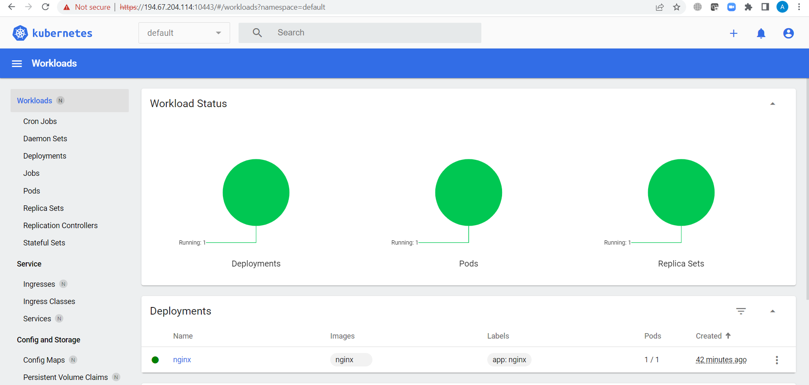
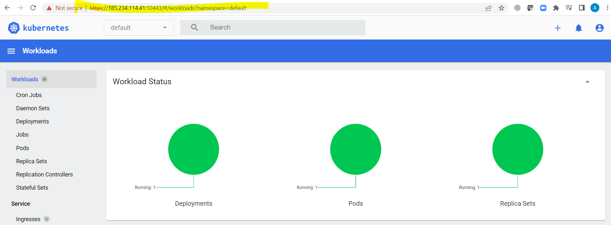

# Домашнее задание к занятию "Kubernetes. Причины появления. Команда kubectl"

### Цель задания

Для экспериментов и валидации ваших решений вам нужно подготовить тестовую среду для работы с Kubernetes. Оптимальное решение — развернуть на рабочей машине или на отдельной виртуальной машине MicroK8S.

------

### Чеклист готовности к домашнему заданию

1. Личный компьютер с ОС Linux или MacOS 

или

2. ВМ c ОС Linux в облаке либо ВМ на локальной машине для установки MicroK8S  

------

### Инструкция к заданию
```
Поставил на vm Ubuntu 20-04, раз уж команды убутовые. Centos 7 шибко устарел для таких новых программ.
```
1. Установка MicroK8S:
    - sudo apt update
    - sudo apt install snapd
    - sudo snap install microk8s --classic
    - добавить локального пользователя в группу `sudo usermod -a -G microk8s $USER`
    - изменить права на папку с конфигурацией `sudo chown -f -R $USER ~/.kube`
```
locadm@vds2295339:~/git/kuber-homeworks$ microk8s version
MicroK8s v1.26.0 revision 4390
```

2. Полезные команды:
    - проверить статус `microk8s status --wait-ready`
    - подключиться к microK8s и получить информацию можно через команду `microk8s command`, например, `microk8s kubectl get nodes`
    - включить addon можно через команду `microk8s enable` 
    - список addon'ов `microk8s status`
    - вывод конфигурации `microk8s config`
    - проброс порта для подключения локально `microk8s kubectl port-forward -n kube-system service/kubernetes-dashboard 10443:443`


3. Настройка внешнего подключения:
    - Отредактировать файл /var/snap/microk8s/current/certs/csr.conf.template
    ```shell
    # [ alt_names ]
    # Add
    # IP.4 = 123.45.67.89
    ```
    - Обновить сертификаты `sudo microk8s refresh-certs --cert front-proxy-client.crt`

4. Установка kubectl:
    - curl -LO https://storage.googleapis.com/kubernetes-release/release/`curl -s https://storage.googleapis.com/kubernetes-release/release/stable.txt`/bin/linux/amd64/kubectl
    - chmod +x ./kubectl
    - sudo mv ./kubectl /usr/local/bin/kubectl 
    - настройка автодополнения в текущую сессию `bash source <(kubectl completion bash)`
    - добавление автодополнения в командную оболочку bash `echo "source <(kubectl completion bash)" >> ~/.bashrc`

------

### Инструменты/ дополнительные материалы, которые пригодятся для выполнения задания

1. [Инструкция](https://microk8s.io/docs/getting-started) по установке MicroK8S
2. [Инструкция](https://kubernetes.io/ru/docs/reference/kubectl/cheatsheet/#bash) по установке автодополнения **kubectl**
3. [Шпаргалка](https://kubernetes.io/ru/docs/reference/kubectl/cheatsheet/) по **kubectl**

------

### Задание 1. Установка MicroK8S

1. Установить MicroK8S на локальную машину или на удаленную виртуальную машину
```bash
locadm@vds2295339:~/git/kuber-homeworks$ microk8s status --wait-ready
microk8s is running
high-availability: no
  datastore master nodes: 127.0.0.1:19001
  datastore standby nodes: none
```
2. Установить dashboard

```bash
Добавли Dashboard
Для разминки поставил док -  произвольный app nginx

root@vds2295339:~# microk8s kubectl get all --all-namespaces
NAMESPACE            NAME                                            READY   STATUS    RESTARTS   AGE
kube-system          pod/kubernetes-dashboard-dc96f9fc-gq89r         1/1     Running   0          49m
kube-system          pod/dashboard-metrics-scraper-7bc864c59-mjdvz   1/1     Running   0          49m
default              pod/nginx-748c667d99-tqh6k                      1/1     Running   0          48m
kube-system          pod/hostpath-provisioner-69cd9ff5b8-mqhjk       1/1     Running   0          33m
kube-system          pod/calico-kube-controllers-c466b55cf-4j9v4     1/1     Running   0          53m
kube-system          pod/calico-node-6xpxj                           1/1     Running   0          53m
kube-system          pod/metrics-server-6f754f88d-b9n5h              1/1     Running   0          51m
kube-system          pod/coredns-6f5f9b5d74-ktzz8                    1/1     Running   0          49m
container-registry   pod/registry-77c7575667-5j9dv                   1/1     Running   0          20m

NAMESPACE            NAME                                TYPE        CLUSTER-IP      EXTERNAL-IP   PORT(S)                  AGE
default              service/kubernetes                  ClusterIP   10.152.183.1    <none>        443/TCP                  53m
kube-system          service/metrics-server              ClusterIP   10.152.183.78   <none>        443/TCP                  51m
kube-system          service/kubernetes-dashboard        ClusterIP   10.152.183.72   <none>        443/TCP                  51m
kube-system          service/dashboard-metrics-scraper   ClusterIP   10.152.183.48   <none>        8000/TCP                 51m
kube-system          service/kube-dns                    ClusterIP   10.152.183.10   <none>        53/UDP,53/TCP,9153/TCP   50m
default              service/nginx                       ClusterIP   10.152.183.81   <none>        80/TCP                   45m
container-registry   service/registry                    NodePort    10.152.183.63   <none>        5000:32000/TCP           20m

NAMESPACE     NAME                         DESIRED   CURRENT   READY   UP-TO-DATE   AVAILABLE   NODE SELECTOR            AGE
kube-system   daemonset.apps/calico-node   1         1         1       1            1           kubernetes.io/os=linux   53m

NAMESPACE            NAME                                        READY   UP-TO-DATE   AVAILABLE   AGE
kube-system          deployment.apps/calico-kube-controllers     1/1     1            1           53m
kube-system          deployment.apps/metrics-server              1/1     1            1           51m
kube-system          deployment.apps/kubernetes-dashboard        1/1     1            1           51m
kube-system          deployment.apps/dashboard-metrics-scraper   1/1     1            1           51m
kube-system          deployment.apps/coredns                     1/1     1            1           50m
default              deployment.apps/nginx                       1/1     1            1           48m
kube-system          deployment.apps/hostpath-provisioner        1/1     1            1           33m
container-registry   deployment.apps/registry                    1/1     1            1           20m

NAMESPACE            NAME                                                  DESIRED   CURRENT   READY   AGE
kube-system          replicaset.apps/calico-kube-controllers-79568db7f8    0         0         0       53m
kube-system          replicaset.apps/calico-kube-controllers-c466b55cf     1         1         1       53m
kube-system          replicaset.apps/metrics-server-6f754f88d              1         1         1       51m
kube-system          replicaset.apps/kubernetes-dashboard-dc96f9fc         1         1         1       49m
kube-system          replicaset.apps/dashboard-metrics-scraper-7bc864c59   1         1         1       49m
kube-system          replicaset.apps/coredns-6f5f9b5d74                    1         1         1       49m
default              replicaset.apps/nginx-748c667d99                      1         1         1       48m
kube-system          replicaset.apps/hostpath-provisioner-69cd9ff5b8       1         1         1       33m
container-registry   replicaset.apps/registry-77c7575667                   1         1         1       20m
```

3. Сгенерировать сертификат для подключения к внешнему ip-адресу

```bash
Поскольку VM удаленный, запустил прокси, вход по токену:
locadm@vds2295339:~/git/kuber-homeworks$ microk8s dashboard-proxy

Checking if Dashboard is running.
Infer repository core for addon dashboard
Waiting for Dashboard to come up.
Trying to get token from microk8s-dashboard-token
Waiting for secret token (attempt 0)
Dashboard will be available at https://127.0.0.1:10443
```

Открыл Дашборд с внешнего IP



```bash
    Один pod под nginx
```
------

### Задание 2. Установка и настройка локального kubectl
1. Установить на локальную машину kubectl
На другой VM
```bash
locadm@netology01:~/.kube$ kubectl version
WARNING: This version information is deprecated and will be replaced with the output from kubectl version --short.  Use --output=yaml|json to get the full version.
Client Version: version.Info{Major:"1", Minor:"26", GitVersion:"v1.26.0", GitCommit:"b46a3f887ca979b1a5d14fd39cb1af43e7e5d12d", GitTreeState:"clean", BuildDate:"2022-12-08T19:58:30Z", GoVersion:"go1.19.4", Compiler:"gc", Platform:"linux/amd64"}
Kustomize Version: v4.5.7
Server Version: version.Info{Major:"1", Minor:"26", GitVersion:"v1.26.0", GitCommit:"b46a3f887ca979b1a5d14fd39cb1af43e7e5d12d", GitTreeState:"clean", BuildDate:"2022-12-09T15:09:52Z", GoVersion:"go1.19.4", Compiler:"gc", Platform:"linux/amd64"}
```
2. Настроить локально подключение к кластеру
```bash
Скопировал конфиг подключение с кластерной машины сверху
locadm@netology01:~/.kube$ kubectl get nodes
NAME         STATUS   ROLES    AGE   VERSION
vds2295339   Ready    <none>   23h   v1.26.0
```
3. Подключиться к дашборду с помощью port-forward
```
Прокинул порт на внешний хост, открыл на третьей машины (ноут, нет возможности на ноуте ставить софт).
^Clocadm@netology01:~/.kube$ kubectl port-forward -n kube-system service/kubernetes-dashboard 10443:443 --address='0.0.0.0'
Forwarding from 0.0.0.0:10443 -> 8443
Handling connection for 10443
```


------

### Правила приема работы

1. Домашняя работа оформляется в Github в своем репозитории в файле README.md. Выполненное домашнее задание пришлите ссылкой на .md-файл в вашем репозитории.
2. Файл README.md должен содержать скриншоты вывода команд `kubectl get nodes`, а также скриншот дашборда

------

### Критерии оценки
Зачет - выполнены все задания, ответы даны в развернутой форме, приложены соответствующие скриншоты и файлы проекта, в выполненных заданиях нет противоречий и нарушения логики.

На доработку - задание выполнено частично или не выполнено, в логике выполнения заданий есть противоречия, существенные недостатки.
