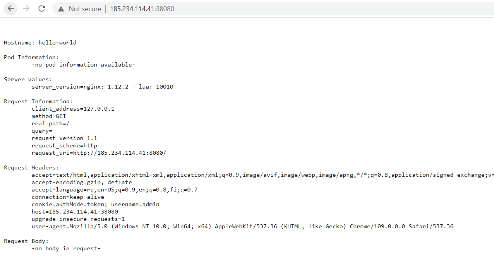
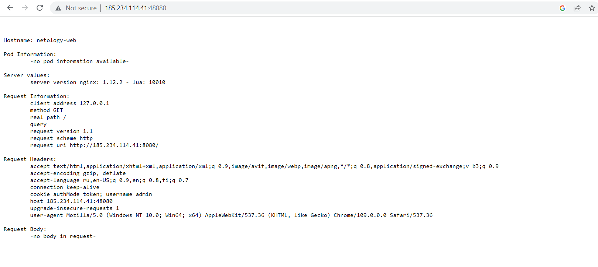

# Домашнее задание к занятию "Базовые объекты K8S"

### Цель задания

В тестовой среде для работы с Kubernetes, установленной в предыдущем ДЗ, необходимо развернуть Pod с приложением и подключиться к нему со своего локального компьютера. 

------

### Чеклист готовности к домашнему заданию

1. Установленное k8s-решение (например, MicroK8S)
```bash
VM1:
locadm@vds2295339:~/git/kuber-homeworks$ microk8s version
MicroK8s v1.26.0 revision 4390
```
2. Установленный локальный kubectl
```bash
VM2:
locadm@netology01:~/git/kuber-homeworks$ kubectl version --short
Flag --short has been deprecated, and will be removed in the future. The --short output will become the default.
Client Version: v1.26.0
Kustomize Version: v4.5.7
Server Version: v1.26.0
```
3. Редактор YAML-файлов с подключенным github-репозиторием
```bash
Традиционно удаленное ssh-подключени Visual Studio Code на машине VM2. C форком репы задания на личный аккаунт с прокинутым ssh-ключем на машину VM2. 
```
------

### Инструменты/ дополнительные материалы, которые пригодятся для выполнения задания

1. Описание [Pod](https://kubernetes.io/docs/concepts/workloads/pods/) и примеры манифестов
2. Описание [Service](https://kubernetes.io/docs/concepts/services-networking/service/)

------

### Задание 1. Создать Pod с именем "hello-world"

1. Создать манифест (yaml-конфигурацию) Pod
2. Использовать image - gcr.io/kubernetes-e2e-test-images/echoserver:2.2
```bash
locadm@netology01:~/git/kuber-homeworks/1.2$ kubectl apply -f pod_netology_web.yaml 
pod/hello-world created

locadm@netology01:~/git/kuber-homeworks/1.2$ kubectl get pods -o wide
NAME                     READY   STATUS    RESTARTS   AGE     IP           NODE         NOMINATED NODE   READINESS GATES
hello-world              1/1     Running   0          2m15s   10.1.36.75   vds2295339   <none>           <none>

```
3. Подключиться локально к Pod с помощью `kubectl port-forward` и вывести значение (curl или в браузере)
```bash
locadm@netology01:~/git/kuber-homeworks/1.2$ kubectl port-forward pods/hello-world 38080:8080 --address='0.0.0.0'
Forwarding from 0.0.0.0:38080 -> 8080
```


------
Файл:
[pod_netology_web.yaml](pod_netology_web.yaml)


### Задание 2. Создать Service и подключить его к Pod

1. Создать Pod с именем "netology-web"
2. Использовать image - gcr.io/kubernetes-e2e-test-images/echoserver:2.2
3. Создать Service с именем "netology-svc" и подключить к "netology-web"
``` bash
locadm@netology01:~/git/kuber-homeworks/1.2$ kubectl get pods,svc,ep
NAME               READY   STATUS    RESTARTS   AGE
pod/netology-web   1/1     Running   0          58s

NAME                   TYPE        CLUSTER-IP       EXTERNAL-IP   PORT(S)    AGE
service/kubernetes     ClusterIP   10.152.183.1     <none>        443/TCP    6d23h
service/netology-web   ClusterIP   10.152.183.150   <none>        8080/TCP   34s

NAME                     ENDPOINTS              AGE
endpoints/kubernetes     194.67.204.114:16443   6d23h
endpoints/netology-web   10.1.36.80:8080        34s
```
4. Подключиться локально к Service с помощью `kubectl port-forward` и вывести значение (curl или в браузере)
```bash
locadm@netology01:~/git/kuber-homeworks/1.2$ kubectl port-forward svc/netology-web 48080:8080 --address="0.0.0.0"
Forwarding from 0.0.0.0:48080 -> 8080
```

------
Файлы:
[pod_netology_web.yaml](pod_netology_web.yaml)
[svc_netology_web.yaml](svc_netology_web.yaml)
### Правила приема работы

1. Домашняя работа оформляется в Github в своем репозитории в файле README.md. Выполненное домашнее задание пришлите ссылкой на .md-файл в вашем репозитории.
2. Файл README.md должен содержать скриншоты вывода команд `kubectl get pods`, а также скриншот результата подключения
3. Репозиторий должен содержать файлы манифестов и ссылки на них в файле README.md

------

### Критерии оценки
Зачет - выполнены все задания, ответы даны в развернутой форме, приложены соответствующие скриншоты и файлы проекта, в выполненных заданиях нет противоречий и нарушения логики.

На доработку - задание выполнено частично или не выполнено, в логике выполнения заданий есть противоречия, существенные недостатки.
